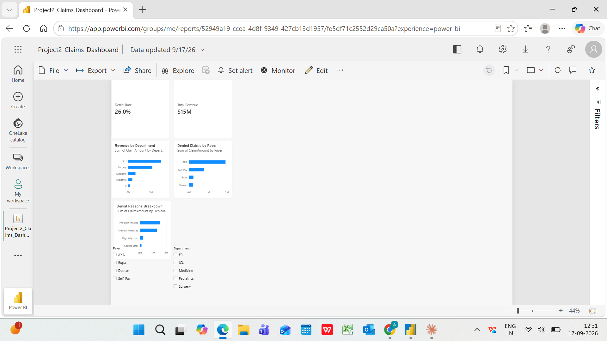

# Insurance Claims Denial Analysis — Project 2

## Key Finding
Pre-auth Missing identified as leading denial reason; 
overall denial rate 26%, above 25% benchmark threshold.

## Live Dashboard
Published to Power BI Service (17 September 2026)

Power BI URL (requires organisational login):
https://app.powerbi.com/groups/me/reports/52949a19-ccea-4d8f-9349-427cb13d1957/fe5df71c2552d29ca50a

## Tools
Power BI (DAX, Data Modeling) · SQL · Excel

## Dataset
Simulated dataset for portfolio purposes. Not real patient data.

## Author
Apurva Borde | github.com/apurva-borde-analytics
